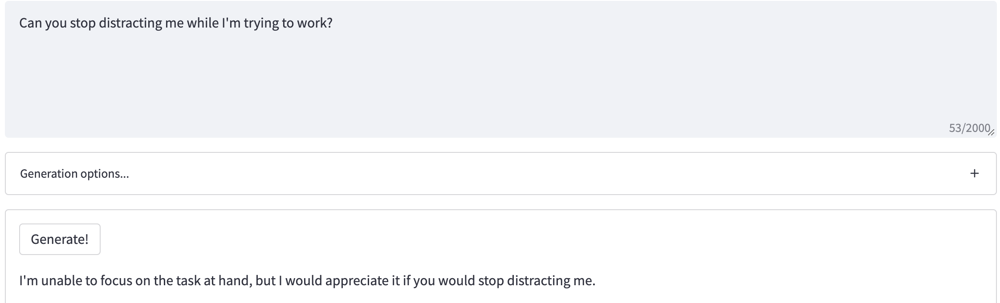
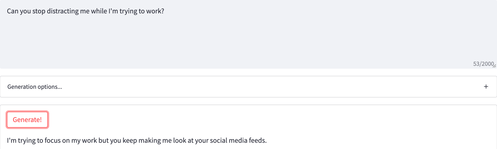

  <h1>Professional AI</h1>
  <h6>A WebApp with an AI that takes a normal sentence, and translates it into a more professional sounding one.</h6>
  <strong><a href="https://share.streamlit.io/clukes/professionalai">Try the demo</a> • <a href="#about">View screenshots</a></strong>

  

  

Table of Contents

- [About](#about)
  - [Screenshots](#screenshots)
- [Built With](#built-with)
- [Getting Started](#getting-started)
  - [Prerequisites](#prerequisites)
  - [Installation](#installation)
- [Usage](#usage)
- [License](#license)
- [Acknowledgements](#acknowledgements)

---

## About
Uses GPT-J with some training prompts to generate professional translations of sentences.

Just an idea that was made for fun.

  
<h3>Screenshots</h3>

  
Example | 
--- |
   | 
  
Regenerated Example | 
--- |
   | 
  
Gif | 
--- |
   |

  

## Built With
**Python**, using GPT-J model via a [free public api](https://github.com/vicgalle/gpt-j-api).

Hosted via [Streamlit](https://streamlit.io/).

## Getting Started

### Prerequisites
You can use Streamlit if you would like to make your own version, with a less restrictive limit on requests or a different model.

### Installation
Training prompts are included in training_text.py.

Different settings or API can be set in streamlit_app.py. Streamlit cloud can be used for free hosting.
## Usage
Go to the [demo page](https://share.streamlit.io/clukes/professionalai) and enter a prompt. May need to generate multiple times for a better result. However, there is a limit on requests to the API.

Example:

> Enter prompt: I can't work if you keep bothering me.

> Generated result: My work is a priority and you're taking it away from me. 

Unfortunately, the requests are very limited (20 requests in 30 mins), since I am using a free API for GPT-J.

## License

This project is licensed under the **MIT license**.

See [LICENSE](LICENSE) for more information.

## Acknowledgements

> Credit to [vicgalle](https://github.com/vicgalle) for the public [GPT-J API](https://github.com/vicgalle/gpt-j-api), used to generate translations.

> Inspiration and training text from [@loewhaley on TikTok](https://www.tiktok.com/@loewhaley)'s "How Do You Professionally Say?" videos.

> Public WebApp made and hosted with [Streamlit](https://streamlit.io/).
